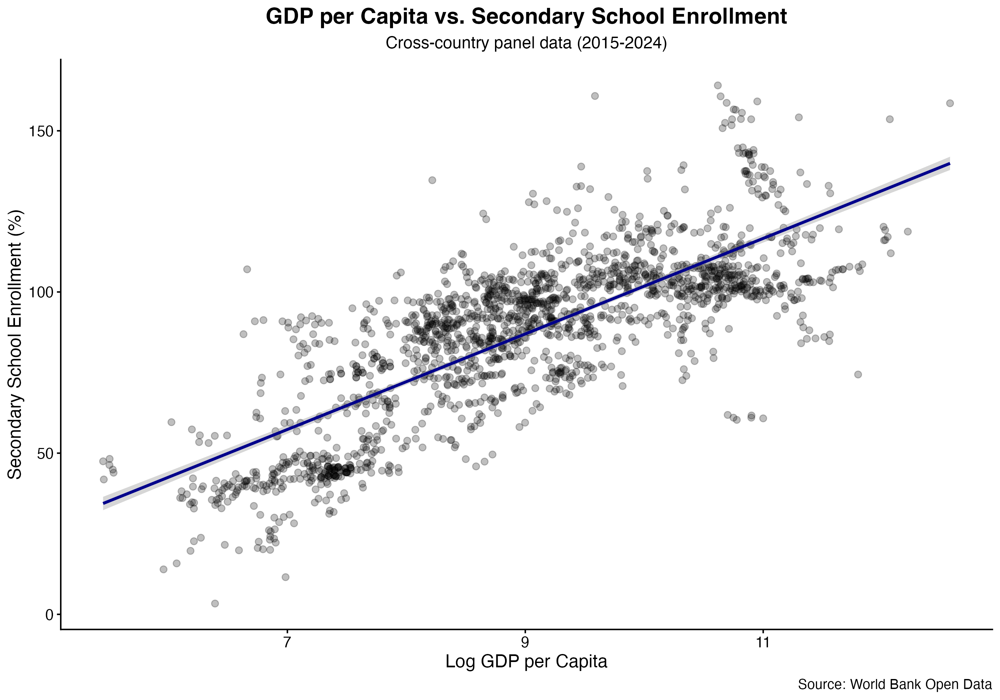

# GDP, Electricity Access, and Secondary School Enrollment


---

## Overview

This project examines the relationship between GDP per capita, access to electricity, and secondary school enrollment across countries from 2015 to 2024 using World Bank Open Data.

---

## Research Question

**How do GDP per capita and access to electricity relate to secondary school enrollment across countries?**

---

## Data

Source: **World Bank Open Data**

Variables used:

- GDP per capita (current US$)
- Secondary school enrollment (% gross)
- Access to electricity (% of population)

Final dataset:

- **232 countries**
- **1,829 country-year observations**
- **2015–2024**

---

## Methods

- Imported World Bank datasets into R
- Cleaned and transformed the data
- Converted datasets from wide to long format
- Merged datasets by country code and year
- Applied a log transformation to GDP per capita
- Conducted exploratory data analysis
- Estimated simple and multiple linear regression models
- Visualized results using ggplot2

---

## Main Findings

- Countries with higher GDP per capita generally had higher secondary school enrollment.
- Adding access to electricity improved the explanatory power of the regression model.
- The final model explained approximately 70% of the variation in secondary school enrollment (R² ≈ 0.70).

---

## Project Structure

```
analysis.R                 # Main R script
analysis_data.csv          # Final cleaned dataset

data/
    GDP.csv
    SchoolEnrollment.csv
    ElectricityAccess.csv

figures/
    Figure1_GDP_SchoolEnrollment.png
```

---

## Figure



---

## Software and Packages

- R
- tidyverse
- ggplot2
- World Bank Open Data


## What I Learned

This project helped me gain experience working with real-world datasets in R, including data cleaning, reshaping data, merging multiple datasets, creating visualizations, and estimating regression models using publicly available data.
